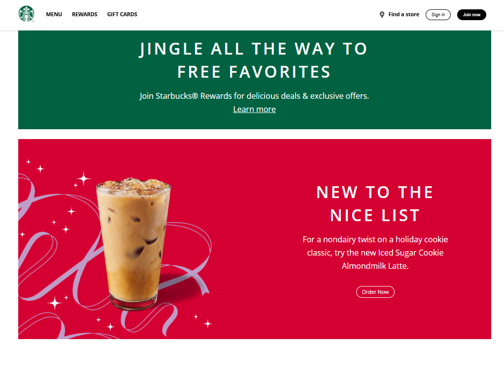

# Starbucks Official Homepage

<div align="center">
  <br />
  
  <br />

  <div>
    
    
    
  </div>

  <h3 align="center">Starbucks Official Homepage</h3>

  <div align="center">
    A responsive website inspired by Starbucks, showcasing menu items, rewards, festive offers, and animations using AOS for a modern user experience.
  </div>

  <div align="center">
    🌐 <strong>Live Demo</strong>: <a href="https://KarthickRamAlagar.github.io/Starbucks/">Starbucks Homepage</a>
  </div>
</div>

---

## 📋 Table of Contents

1. [Introduction](#introduction)  
2. [Tech Stack](#tech-stack)  
3. [Features](#features)  
4. [Quick Start](#quick-start)  
5. [Installation](#installation)  
6. [License](#license)  
7. [Acknowledgements](#acknowledgements)  

---

## Introduction

This Starbucks-themed homepage is built using HTML, CSS, and JavaScript. It features a clean and responsive design, showcasing Starbucks menu items, rewards, and festive offers. The site includes a hamburger menu for mobile users and smooth animations powered by AOS.

---

## Tech Stack

- **HTML5**: Markup language for structuring the website.  
- **CSS3**: Styling language for designing the website.  
- **JavaScript**: Adds interactivity and functionality to the website.  

---

## Features

👉 **Responsive Design**: Ensures seamless functionality and aesthetics across all devices.  
👉 **Navigation Menu**: Includes a desktop menu and a hamburger menu for mobile users.  
👉 **AOS Animations**: Smooth animations for an engaging user experience.  
👉 **Footer Links**: Includes links to social media platforms and copyright information.  

---

## Quick Start

Follow these steps to set up the project locally on your machine.

### Prerequisites

Make sure you have the following installed:

- [Git](https://git-scm.com/)
- A modern web browser

### Cloning the Repository

```bash
git clone https://github.com/karthickramalagar/Starbucks.git
cd Starbucks
```
## Installation
No additional dependencies are required. Simply open the index.html file in your browser to view the website.
## License
This project is licensed under the MIT License.

## Acknowledgements
👉 HTML5
👉 CSS3
👉 JavaScript
👉 AOS Library
